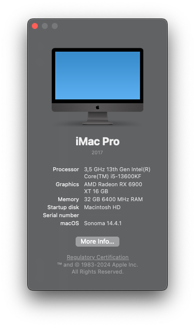
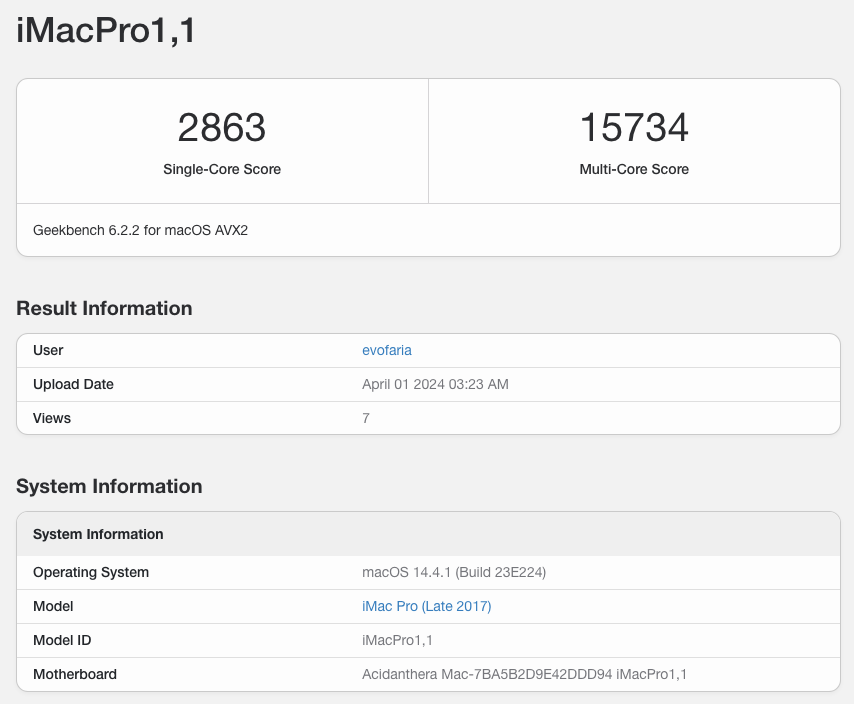
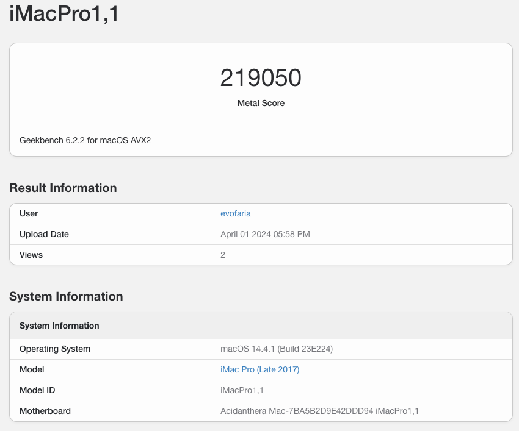
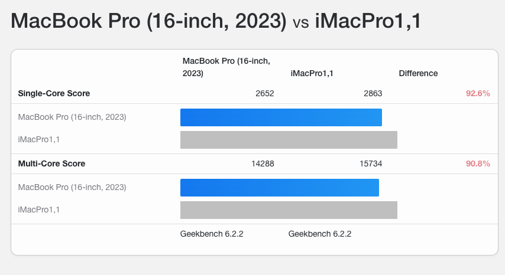
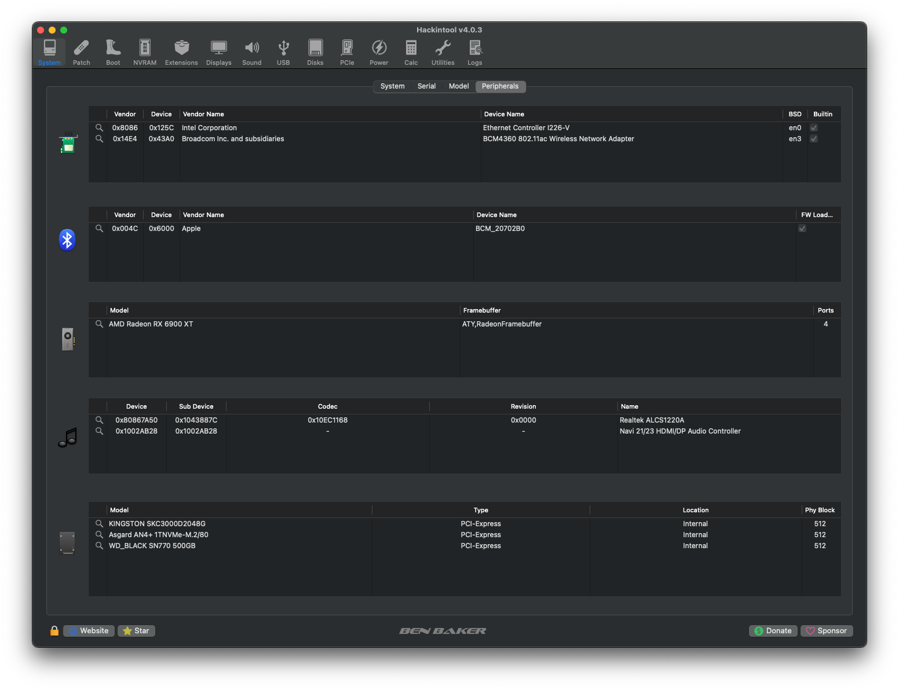
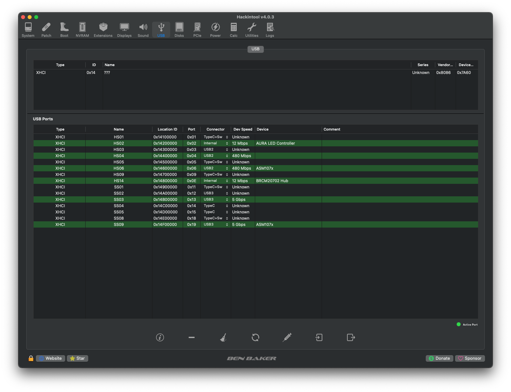

ASUS TUF GAMING Z790-PLUS WIFI DDR5 + i5 13600KF + RX 6900XT 16GB
=======================

### Basic Information

* **MacOS**: Sonoma (14.4.1)
* **OpenCore**: 0.9.9
* **Updated: 01 Apr 2024**

## Hardware Specifications

| Part                 |                    Description                     |
|----------------------|:--------------------------------------------------:|
| BIOS                 |                 1641 -  2024/02/29                 |
| CPU                  |   Intel Core i5 13600KF - (OC 5600MHz / 4200MHz)   |
| Memory               | Corsair Vengeance 32Gb DDR5 6000MHz - (OC 6400MHz) |
| Storage MacOS        |                WD_Black SN770 500GB                |
| Storage Time Machine |                  Asgard AN4+ 1TB                   |
| Storage Windows      |                Kingston KC3000 2TB                 |
| GPU                  |  AMD Radeon RX 6900 XT - (XFX Speedster MERC 319)  |
| Ethernet             |        Intel(R) Ethernet Controller I226-V         |
| WLAN+Bluetooth       |       Wifi card replaced by Fenvi BCM94350NG       |
| Audio                |                 Realtek ALCS1220A                  |

## ScreenShots

## Thanks/Credits

* [OpenCore Team](https://dortania.github.io/getting-started/)
* [Gabriel Luchina](https://github.com/luchina-gabriel)

